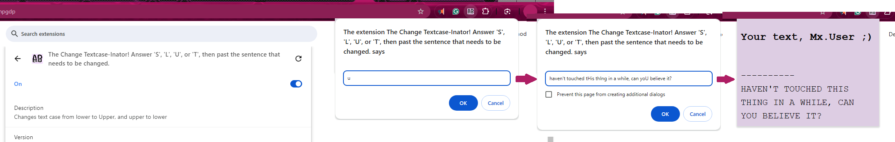

# **The TextCase-inator!! * ✧ .**



Hey Ehh here,

Here to show you that using this little thang is simple. You click the icon, it tells you to put in any of those letters, but you could also write in uppercase, lowercase, etc if you're feeling like that. You paste or write in your sentence, then it'll give you text to select and copy, since I haven't written the function to do it automatically yet. Sorry. But that's it. It's pretty simple.

I do recommend looking more into pyscript for extensions though, there's a lot more things you could do with it than this. I just had a very specific problem that only a quick extension could solve, and that problem is having the habit of typing things and *then* realising what case I want to be in WAY after typing it. There have been too many times I've typed things and realised the tone would be much better if it were all caps, but it's like 5 sentences I really don't want to retype or google a lower-to-upper converter online. So boom, quick extension always at the ready.

I actually found all this back in 2023, before I'd had as much coding experience as I do now, and there's two things that stick out to me. First, WOW I was really so scared to learn JavaScript that I found PyScript for this since Python was the only language I knew back in 2023. I'm looking at it like "This would've been so much easier if I just stuck to JS", but I need to fall back in love with python honestly. Second, I remember when I told people I was doing this and they thought I was wasting my time. If I was any normal typer, probably would be a waste of time, but my dyslexic ass cannot be retyping paragraphs. Unironically, this extension is one of my favourites, and hell it should be since I made it to solve my very specific problem!

Yap fest over, carry on :V


## Original README Information! -- pyscript-local-runtime

This repository provides a framework for running PyScript and all its runtime dependencies locally e.g. to create a Chrome extension using Python, or an offline web app using PyScript without relying on internet access.

PyScript and its dependency Pyodide continue to evolve but this demo is frozen at Pyodide v0.21.3. You're strongly advised to check out the [latest version of PyScript](https://pyscript.net/) and there are numerous PyScript tutorials online for learning more about its capabilities - that's not the focus of this Demo!

All the files you need to run PyScript (at v0.21.3) are in the `/runtime` directory and you can also download them on POSIX using wget...
   ```shell
   cd runtime
   source setup.sh
   ```

or on Windows using the helper script supplied:
   ```
   cd runtime
   python setup.py
   ```

## **OLD EXAMPLE CHROME EXTENSION**


This example Chrome Extension launches a Popup when clicked, renders the time using Python's `datetime` module, and provides a Python REPL session for you to play with directly inside the extension.

To use this extension directly, first clone it to your local machine then
[follow this tutorial](https://medium.com/p/6c6b0e2e1573) to load the unpacked extension into Chrome and pin it to your Extensions toolbar.

* Icons are in the `/icons` folder.
* PyScript/Pyodide files to run this offline or as part of an extension are in the `/runtime` folder.
* Other magic required for Chrome to recognise this as an extension is in `manifest.json`.
* `popup.css` is a super-simple Cascading Style Sheet which defines the appearance of the Popup - in this case simply the width, height, and background colour.
* `popup.html` defines the page content of the Popup. It includes some simple boiler-plate HTML as well as some examples of Python code which runs under the tags `<py-script>` and/or `<py-repl>`.
* `popup.html` must include a `<py-config>` block as follows:

   ```html
   <py-config>
         [[runtimes]]
         src = "runtime/pyodide.js"
         name = "pyodide-0.21.3"
         lang = "python"
   </py-config>
   ```

* `popup.html` must also include two lines to load PyScript and its default stylesheet into the extension:

   ```html
   <link rel="stylesheet" href="runtime/pyscript.css" />
   <script defer src="runtime/pyscript.js"></script>
   ```

Further information about getting started with Chrome Extensions is available [here](https://developer.chrome.com/docs/extensions/mv3/getstarted/).

All the best,
Pete

https://github.com/PFython

## **CREDITS**

A big "Thank You" to https://github.com/tedpatrick (Engineering Manager at Anaconda) for pointing me in the right direction.

If this code helps you save time and focus on more important things, please feel free to to show your appreciation by starring the repository on Github.

I'd also be delighted if you wanted to:

<a href="https://www.buymeacoffee.com/pfython" target="_blank"></a>

